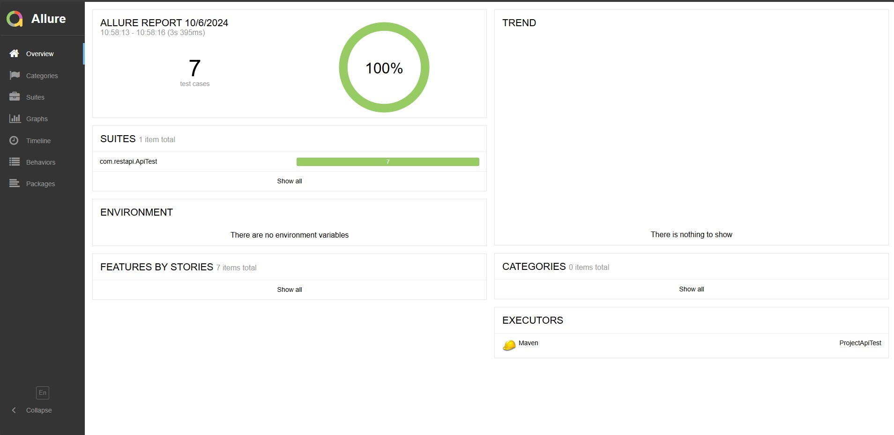

# Projeto de Teste de API utilizando RestAssured

O projeto foi desenvolvido em Java + RestAssured para testar a API http://jsonplaceholder.typicode.com.


## Stack utilizada

**Linguagem:** Java

**Libs:** RestAssured, Maven, Allure Reports, Junit.


## Documentação da API

#### Retorna uma lista de posts

```http
  GET http://jsonplaceholder.typicode.com/posts
```

#### Guide
```http
  http://jsonplaceholder.typicode.com/guide/
```
## Rodando os testes

Para rodar os testes, rode os seguintes comandos:

Utilizando maven:
```bash
  mvn clean install
  mvn clean test
```

Para utilizar servidor Allure Reports:
```bash
  mvn allure:serve
```

## Screenshots relatório Allure




## Autor

- [@lucasilvadrm](https://www.github.com/lucasilvadrm)

